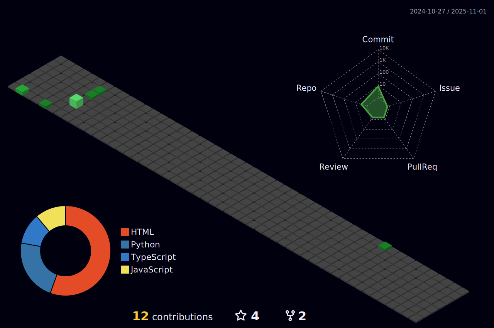

##  Hi there. I'm Murilo!

**`Full Stack Developer`**

I'm an enthusiastic young coder, an avid learner, creative and good-natured. I develop Full Stack applications, that is, for client, server, mobile, database, etc. My goal is to contribute in different fields, in which my technical and personal skills are applied, whether in team projects, as a freelancer, or in solving complex problems.

- 🔥 Intern Developer.

- 💻 Systems Development technician.

- 💼 I'm looking for job opportunities.

- 🔭 I’m currently working on personal web projects with **TypeScript, ReactJS and NodeJS API**.

- 👯 I’m looking to collaborate on open-source projects and **UI/UX** Design applications.

### 🌐 Socials

<a href="https://www.instagram.com/lilo.mma" target="_blank">

</a>
<a href="mailto: murilo.alves28@outlook.com" target="_blank">

### 🛠️ Main Tech

#### Back end

#### Front end

#### Mobile

#### Database

#### DevOps

### 📊 GitHub Stats

  

  
  

<!--  -->
